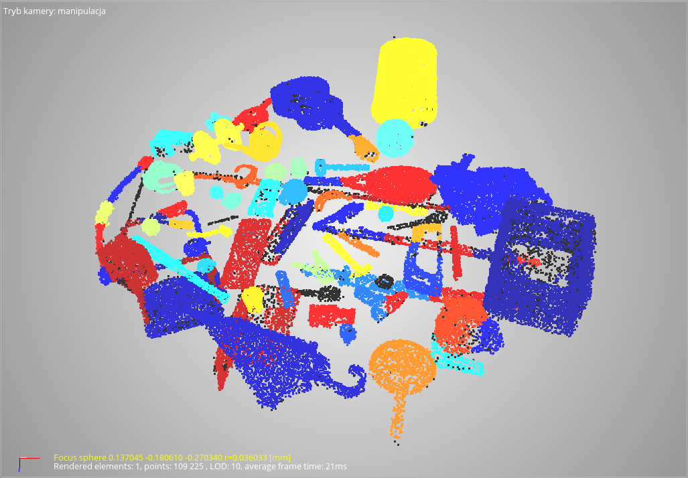
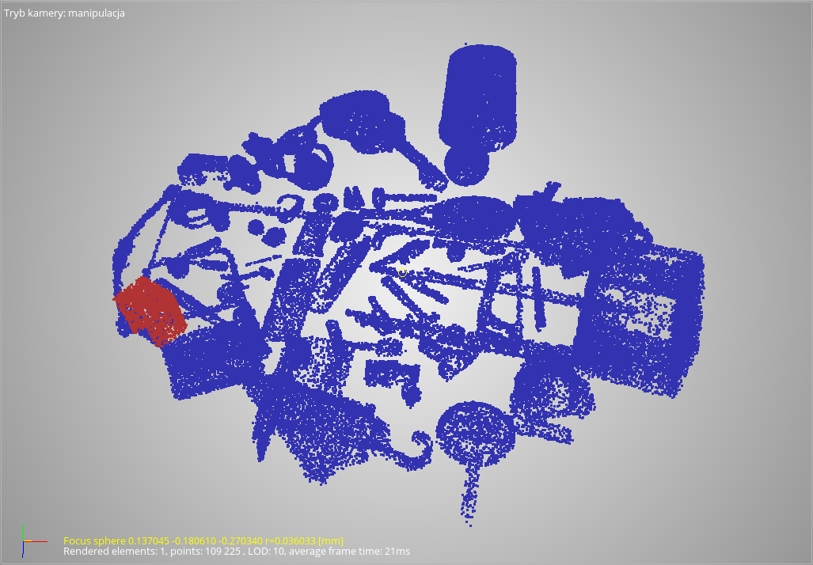

# points-cloud-processing

Plugin for FRAMES SDK to detection the item in the 3D points cloud. The project was realized for completion a subject during studies and uses FRAMES modules developed by employees of the Faculty of Mechatronics at WUT.

## Used technologies

- C++
- Visual Studio
- Qt
- FRAMES SDK

## Results

Cloud segmentation

Required item (loundspeaker) detection

## Requirements and configuration

- Install Visual Studio 2019
- Install Qt (5.14 or later): <https://www.qt.io/download>
  - Install msvc2019_64
  - Install QtCharts
  - Set environment variable QTDIR = ..\Qt\5.15.2\msvc2019_64
- Install Qt extension to VS
- Download FRAMES (*currently is a private software of Faculty of Mechatronics at WUT*)
- Build whole solution and run QtFRAM3D project (will take a while)
  - Build in 64-bit architecture
  - Update project to new VS version (VS should ask for this)
  - Build for platform v141
